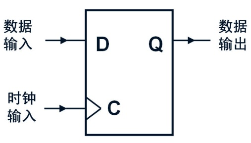
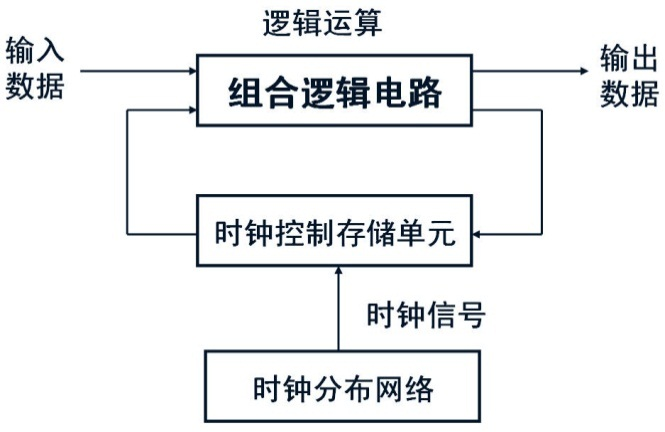

如何用 Markdown + Pandoc 写毕业论文

陆伟成

2018-03-18

Table of Contents {#table-of-contents .TOC}
=================

摘要
====

本文用简明的样例，介绍如何使用 Markdown 和 Pandoc
等自动化工具帮你处理数学公式、参考文献引用、图片交叉索引等学术论文写作中常见的棘手问题。

**关键词：** pandoc pandoc-crossref markdown

Abstract
========

This is a tutorial file for writing a undergraduate thesis using
Markdown and `pandoc`.

**Keywords:** pandoc, pandoc-crossref markdown

第一章 绪论
===========

§1.1 `pandoc`
-------------

Pandoc is a Haskell library for converting from one markup format to
another, and a command-line tool that uses this library. It can read
Markdown and write Word docx.

§1.2 `pandoc-crossref` filter
-----------------------------

With this filter[^1], you can cross-reference figures (see 图 3.1),
display equations (see 公式 3.1), tables (see 表 3.1) and sections (§ 1,
2, 4.1, 4.2)

There is also support for code blocks, for example, 列表 4.1, 4.2.

Subfigures are supported, see 图 5.1, 5.1 (b)

§1.3 `pandoc --reference-doc`
-----------------------------

Use the specified file as a style reference in producing a docx file.
For best results, the reference docx should be a modified version of a
docx file produced using pandoc. The contents of the reference docx are
ignored, but its stylesheets and document properties (including margins,
page size, header, and footer) are used in the new docx.

第二章 List Items
=================

List items may include other lists. In this case the preceding blank
line is optional. The nested list must be indented four spaces or one
tab:

-   fruits

    1.  apples

        -   macintosh

        -   red delicious

    2.  pears

    3.  peaches

-   vegetables

    -   broccoli

    -   chard

Pandoc also pays attention to the type of list marker used, and to the
starting number:

9)  Ninth

10) Tenth

11) Eleventh

    i.  subone

    ii. subtwo

    iii. subthree

Pandoc supports definition lists, using the syntax of PHP Markdown Extra
with some extensions.

Term 1

:   Definition 1

Term 2

:   Definition 2

第三章 图、表、公式
===================

§3.1 图
-------

An image occurring by itself in a paragraph will be rendered as a figure
with a caption.

{width="2.3045450568678914in"
height="1.3136362642169728in"}

图 3.1: This is the caption

(source)

    {#fig:figure0}

If you just want a regular inline image, just make sure it is not the
only thing in the paragraph. One way to do this is to insert a
nonbreaking space after the image:

{width="2.3045450568678914in"
height="1.3136362642169728in"} 

(source)

    \ 

§3.2 表
-------

Simple tables can be generated using Markdown.

*表 3.1*: Table example

                 28nm            20nm
  -------------- --------------- -----------------
  Fab Costs      \$3B            \$4B - \$7B
  Process R&D    \$1.2B          \$2.1B - \$3B
  Mask Costs     \$2M - \$3M     \$5M - \$8M
  Design Costs   \$50M - \$90M   \$120M - \$500M

  : 表 3.1: Table example

(source)

    |              |      28nm     |      20nm       |
    |--------------|:-------------:|:---------------:|
    | Fab Costs    | \$3B          |  \$4B - \$7B    |
    | Process R&D  | \$1.2B        | \$2.1B - \$3B   |
    | Mask Costs   | \$2M - \$3M   | \$5M - \$8M     |
    | Design Costs | \$50M - \$90M | \$120M - \$500M |

    : Table example {#tbl:table1}

§3.3 公式
---------

Display equations are labelled and numbered:

$$P(x) = \sum_{i}^{}a_{i}x^{i}\text{\quad\quad}(3.1)$$

(source)

    $$P(x) = \sum_i a_i x^i$$ {#eq:eqn1}

Those can also appear in the middle of paragraph $x^{2} = 0$ like this.

(source)

    Those can also appear in the middle of 
    paragraph $x^2 = 0$ like this.

第四章 Code blocks
==================

There are a couple options for code block labels. Those work only if
code block id starts with `lst:`, e.g. `{#lst:label}`

§4.1 `caption` attribute
------------------------

`caption` attribute will be treated as code block caption. If code block
has both id and `caption` attributes, it will be treated as numbered
code block.

列表 4.1: Listing caption A

    main :: IO ()
    main = putStrLn "Hello World!"

§4.2 Table-style captions
-------------------------

Enabled with `codeBlockCaptions` metadata option. If code block is
immediately adjacent to paragraph, starting with `Listing:` or `:`, said
paragraph will be treated as code block caption.

列表 4.2: Listing caption B

    main :: IO ()
    main = putStrLn "Hello World!"

第五章 Subfigures
=================

It's possible to group figures as subfigures:

{width="3.022726377952756in"
height="1.963636264216973in"}

a

{width="2.3045450568678914in"
height="1.3136362642169728in"}

b

图 5.1: Caption of figure. a --- subfigure 1 caption, b --- subfigure 2
caption

(source)

    

    {#fig:subfigureA}

    {#fig:subfigureB}

    Caption of figure
    

To sum up, subfigures are made with a div having a figure id. Contents
of said div consist of several paragraphs. All but last paragraphs
contain one subfigure each, with captions, images and (optionally)
reference attributes. Last paragraph contains figure caption.

第五章 文献综述
===============

王国成阐述了大数据的特性变迁过程^\[1\]^。

其他学者讲述了大数据的价值和处理方式^\[2,3\]^。

附表一：`crossref.yaml`
=======================

    ---
    cref: False
    chapters: True
    chaptersDept: 2
    codeBlockCaptions: True
    figureTitle: "图 "
    tableTitle: "表 "
    listingTitle: "列表 "
    tableTemplate: "*$$tableTitle$$ $$i$$*$$titleDelim$$ $$t$$"
    autoSectionLabels: True
    figPrefix:
      - "图"
    eqnPrefix:
      - "公式"
    tblPrefix:
      - "表"
    lstPrefix:
      - "列表"
    secPrefix:
      - "§"
    ...

致谢
====

thanks everyone

参考文献
========

\[1\] 王国成. 从3V到5V:大数据助推经济行为的深化研究\[J\]. 天津社会科学,
2017(2): 94--99.

\[2\] 于晓龙, 王金照. 大数据的经济学涵义及价值创造机制\[J\].
中国国情国力, 2014(2): 28--30.

\[3\] 徐计, 王国胤, 于洪. 基于粒计算的大数据处理\[J\]. 计算机学报,
2015(8): 1497--1517.

[^1]: This file is generated by the command:

    > > pandoc -F pandoc-crossref -F pandoc-citeproc
    > > --bibliography=reference.bib
    > > --csl=chinese-gb7714-2005-numeric.csl
    > > --reference-doc=fd\_bylw\_t.docx --toc demo.md crossref.yaml -o
    > > temp.docx
